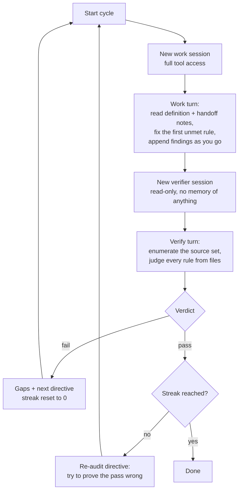

```
███████╗██╗   ██╗███████╗██╗   ██╗███████╗
██╔════╝╚██╗ ██╔╝╚══███╔╝╚██╗ ██╔╝██╔════╝
███████╗ ╚████╔╝   ███╔╝  ╚████╔╝ █████╗
╚════██║  ╚██╔╝   ███╔╝    ╚██╔╝  ██╔══╝
███████║   ██║   ███████╗   ██║   ██║
╚══════╝   ╚═╝   ╚══════╝   ╚═╝   ╚═╝
```

# Syzyf

**An OpenCode addon that keeps rolling the boulder until the job is actually done.**

Syzyf drives [opencode](https://opencode.ai) in a loop. You write a **Definition of Done**, and it
works towards it across as many fresh sessions as the job needs — then refuses to stop until an
independent, read-only verifier confirms three times in a row that every rule is met.

The verdict is binary. Either every rule is met, or the job is not done. No score, no percentage, no
partial credit.

---

## Why this exists

A single agent session has a bounded context window. Any job bigger than that window ends the same
way: the agent runs out of room, writes a confident summary, and stops with the work half finished.

Syzyf assumes that will happen and builds around it:

- **Each cycle is one fresh session.** Nothing is carried in conversation memory. State travels
  through the repository on disk plus a handoff notes file.
- **The worker never grades itself.** A separate verifier session, with editing disabled, judges the
  repository from the source data and the produced artifacts. It is explicitly told that the handoff
  notes are unverified claims, not evidence.
- **One pass is not enough.** By default three consecutive passing verdicts, each from a brand-new
  verifier session, are required. Any single failure resets the streak to zero.

That last part is the whole point. The most expensive failure mode of an agent loop is not a stall,
it is a weak model deciding it is finished. A stalled loop is recoverable; a false pass is not.

---

## How a cycle works



The verifier never sees the work transcript. Its prompt carries only the Definition of Done and the
cycle number, and it must open the actual files with `read`, `glob`, `grep`, and `list` before it may
judge a rule. For any rule quantified over a set ("every packet", "all files"), it has to enumerate
that set **from the source** and report the source count against the covered count. An enumeration it
cannot finish is a gap, not a pass.

After a passing verdict that has not yet reached the streak, the next work turn is not idle — it is
told to attack the verdict: enumerate the set again, spot-check finished entries in detail, hunt for
placeholder bodies and stub sections, and fix whatever it finds.

---

## Requirements

| Thing | Why | Notes |
|---|---|---|
| Python 3.10+ | runs `install.py` | only for setup |
| [Bun](https://bun.com/install) 1.3+ | runs `dod-loop.ts` | installed by `install.py` |
| [opencode](https://opencode.ai) 1.18.18 | the TUI, which is also the server | installed by `install.py`, pinned |
| An opencode login | model access | `opencode auth login`; defaults to Zen free models |
| Windows | `run-dod-loop.bat` | the loop itself is platform-neutral, see [Running without the batch file](#running-without-the-batch-file) |

---

## Install

```
python install.py
```

Double-clicking it works too. It installs Bun, installs the pinned opencode, runs `bun install`,
checks that you are authenticated, and verifies that the source folder your Definition of Done names
actually exists on this machine.

It never touches `.opencode/dod.md` or anything under `projectfiles/` — those are your content.

```
python install.py --check-only     report status, install nothing
python install.py --no-pause       do not wait for a keypress
```

If Bun or opencode were just installed, open a **new** terminal so `PATH` picks them up.

---

## Write your Definition of Done

`.opencode/dod.md` is the template every run starts from. It has two sections:

```markdown
# 1. Task to perform

Access `C:\path\to\your\source-folder`. This is <what the source is> and it has <what it holds>.
Write a <RECORD> library in `<artifact>.md` in this folder, keyed by <the key you group records by>,
defining every value in every <RECORD>. ...

# 2. Definition of Done

Work is not done if there is still any <RECORD> with unidentified information
e.g. unknown <FIELD>s purpose. ...

But all <RECORD>s need to have definition of all <FIELD>s. Skipping these is unacceptable
```

Section 1 is what to do, section 2 is how you know it is finished. The split is for your benefit while
writing and editing: **the file is stored and handed to the verifier as one string**, so nothing in the
loop has to care where the boundary falls.

Getting this file right is the one expensive decision here. The loop will chase a badly worded rule
for as many cycles as you give it, and every cycle costs a full context window.

What works:

- **Name the source with an absolute path.** The verifier judges against source data, so it needs to
  find it. `install.py` checks that the path resolves.
- **Name the artifact explicitly.** "Write `packet_library.md` in this folder" is checkable; "document
  the protocol" is not.
- **Quantify.** "Every value in every record" gives the verifier a set to enumerate. Vague rules pass
  too easily.
- **State what does not count as done.** The example spells out that any record with an unidentified
  field means the job is unfinished, and that skipping records is unacceptable.

`.opencode/dod.md` is a **template**. Each run copies it once into its own folder, so editing the
template never retroactively changes what an earlier run was judged against.

---

## Run

```
run-dod-loop.bat
run-dod-loop.bat "an optional directive that overrides cycle 0"
```

What happens:

1. A run folder is allocated: `projectfiles/00001/`, and the template is copied in as
   `definition.md`.
2. The review window opens. Two editable boxes, the task on top and the Definition of Done below,
   already in edit mode — there is no mode to switch into and no menu to walk. **Save and launch**
   writes both boxes back as the one file and starts the run; **Quit** keeps the folder for later.
   Nothing starts until you have approved what this run is aiming at.
3. The opencode TUI starts and **owns the server** on port 4096.
4. The loop runs against that server until the pass streak is reached, the cycle budget runs out, or
   something breaks.

To watch a cycle: focus the TUI, press `ctrl+p`, pick `00001 work 0` or `00001 verify 0`.

> **Do not close the TUI while the loop runs.** That window *is* the server.

### The review window

`definition-gui.ps1`, plain WinForms in a dark theme. It ships with Windows, so there is no dependency
to install and nothing to keep in sync with `package.json`.

- Both boxes are editable from the moment it opens. `Ctrl+Enter` launches, `Esc` quits.
- Saving always writes back the canonical `# 1. Task to perform` / `# 2. Definition of Done` headings,
  so an older single-section definition normalises itself the first time you open it here.
- Closing the window with the X counts as Quit, never as approval.
- An empty Definition of Done is refused: there would be nothing to verify against, so the run could
  never pass.

The script is deliberately pure ASCII. Windows PowerShell 5.1 reads a BOM-less script as ANSI, so the
logo is stored as ASCII placeholders and the block characters are substituted in at runtime.

Two switches, neither of which opens a window:

```
powershell -NoProfile -File .\definition-gui.ps1 -Path projectfiles\00001\definition.md -SelfTest
powershell -NoProfile -File .\definition-gui.ps1 -Path projectfiles\00001\definition.md -Normalize
```

`-SelfTest` prints how a definition splits, for when a file does not land in the boxes you expected.
`-Normalize` rewrites it with the canonical headings in place.

To review in a text editor instead, `set DOD_LOOP_TEXT_REVIEW=1`. That path opens `%EDITOR%` straight
away (default `notepad`; `set EDITOR=code -w` works) and asks once, on close, whether to launch. It is
also the automatic fallback on a machine where WinForms will not load.

### Why the TUI owns the server

The opencode TUI has no attach-to-an-existing-server mode. It always spawns its own server in a
worker, and `--port` only tells that worker which port to bind — it never dials an external server.

The obvious arrangement (`opencode serve` for the loop, a separate TUI to watch it) gives you two
processes with two event buses over one shared store. The TUI can read the loop's sessions, but every
event comes from the *other* server's bus, so the window renders one snapshot and then sits frozen.
It looks like the agent is stuck when it is not.

Inverting it fixes that: the TUI's own worker serves the API and forwards every event to the window,
so pointing the loop at that port makes its sessions stream live. The tradeoff is that closing the
window ends the run.

For an unattended run with no window to protect:

```
set DOD_LOOP_NO_GUI=1
run-dod-loop.bat
```

---

## Where the files go

Everything a run generates lives under `projectfiles/<run id>/` and nowhere else.

```
projectfiles/
  00001/
    definition.md    the Definition of Done this run is judged against
    state.md         handoff notes carried between cycles
    run.log          the full transcript
```

Run ids are five digits so the folder sorts as plain text, and they iterate: `00001`, `00002`, ...
Session titles use the id too, which is why the TUI picker shows `00001 work 0`.

The whole `projectfiles/` tree is gitignored. It describes whatever job you pointed the loop at, so
it is yours by default.

### The handoff file

`state.md` is the only thing that survives between cycles, and the work turn is told to append to it
continuously rather than at the end — a turn that runs out of context never reaches its own cleanup
step.

It is facts only. The work turn is explicitly forbidden from writing a verdict, a status like "work
complete", or a rule-by-rule evidence section. That rule exists because a run once ended one cycle in:
the work agent wrote "work complete, pending final verification" plus its own evidence section, and
the verifier read the claim as proof. 56 items into a job of about a thousand.

---

## Monitoring

```
powershell -ExecutionPolicy Bypass -File .\status.ps1
powershell -ExecutionPolicy Bypass -File .\status.ps1 -RunId 00003
```

Asks the server directly and reports, for both the work and verify sessions: running or idle, message
count, the last tool used, how long ago, and any pending retry with its reason and due time. A pending
retry is the difference between "thinking" and "blocked for the next two hours". Defaults to the newest
run.

```
powershell -ExecutionPolicy Bypass -File .\preflight.ps1
```

Pre-launch check: is port 4096 in use and by what, are there leftover `opencode` or `bun` processes,
what is in the folder, what runs already exist.

---

## Resuming a run

```
set DOD_RUN_ID=00003
run-dod-loop.bat
```

Reuses that folder, its definition, and its handoff notes. Quitting at the review gate keeps the
allocated folder so you can resume it later.

---

## Configuration

All optional, all environment variables.

### The loop

| Variable | Default | What it does |
|---|---|---|
| `DOD_PASS_STREAK` | `3` | consecutive independent passing verdicts needed to finish |
| `DOD_CYCLE_BUDGET` | unbounded | cap the number of cycles |
| `DOD_RUN_ID` | new run | resume an existing run folder |

A large job needs far more cycles than anyone would guess, since each cycle is one bounded context
window of work. That is why the budget is unbounded by default.

### Models

| Variable | Default |
|---|---|
| `DOD_WORK_MODELS` | `deepseek-v4-flash-free,big-pickle,mimo-v2.5-free` |
| `DOD_VERIFY_MODELS` | `deepseek-v4-flash-free,big-pickle,mimo-v2.5-free` |

Comma-separated chains, tried in order. A bare id is assumed to be a Zen model, so `big-pickle` and
`opencode/big-pickle` mean the same thing.

The chain is worth more than a longer backoff because Zen's free tier is not one shared budget: each
free model is a separate upstream integration with its own capacity, so one model reporting "Free
usage exceeded" says nothing about the rest.

`nemotron-3.5-lightning-free` is deliberately absent from the defaults. A verify turn has to enumerate
hundreds of source files before it may judge a rule, and a small fast model that gives up on the
enumeration and passes anyway is exactly the failure this design exists to prevent.

### Quota and watchdog

| Variable | Default | What it does |
|---|---|---|
| `DOD_QUOTA_COOLDOWN_MS` | `900000` (15m) | wait when the whole chain is rate-limited |
| `DOD_TURN_POLL_MS` | `5000` | how often to check a running turn |
| `DOD_RETRY_TOLERANCE_MS` | `60000` | a retry due sooner than this is transient and worth waiting for |
| `DOD_TURN_DEADLINE_MS` | `2700000` (45m) | backstop for a turn that wedges silently |

The server does not hand a quota refusal back to the caller. It classifies it as retryable, keeps the
request open, and schedules its own retry hours out — you see `Free usage exceeded [retrying in 1h 36m
attempt #1]` while the prompt call is still waiting, and the message record shows no error at all.

So each turn is *watched* rather than waited on: `GET /session/status` exposes the pending retry as a
typed value, and the loop abandons the model within a poll interval of a refusal appearing there, then
aborts the session so the server stops holding a turn nobody wants.

### Launcher

| Variable | Default | What it does |
|---|---|---|
| `PORT` | `4096` | port the TUI binds and the loop dials |
| `EDITOR` | `notepad` | editor for the text review fallback |
| `DOD_LOOP_NO_REVIEW` | unset | skip the review step entirely |
| `DOD_LOOP_TEXT_REVIEW` | unset | review in `%EDITOR%` instead of the window |
| `DOD_LOOP_NO_GUI` | unset | headless `opencode serve`, no TUI |
| `DOD_LOOP_NO_PAUSE` | unset | do not pause at exit |
| `OPENCODE_BASE_URL` | `http://localhost:4096` | set by the launcher from `PORT` |

---

## Exit codes

| Code | Meaning |
|---|---|
| `0` | Definition of Done met |
| `1` | not done — cycle budget reached |
| `2` | the run stopped on an error |

`1` and `2` are kept apart on purpose: "not done" and "crashed" need completely different responses
from you.

---

## Repo layout

```
dod-loop.ts                       the loop: cycles, model chain, watchdog, verdict parsing
run-dod-loop.bat                  launcher: allocate run, review, start TUI, run loop
definition-gui.ps1                the review window: two boxes, saved as one file
install.py                        installs Bun + opencode + deps, checks login and source data
status.ps1                        where is the loop right now
preflight.ps1                     is the folder ready for a clean run
opencode.json                     opencode project config
.opencode/dod.md                  the Definition of Done template
.opencode/agent/dod-verifier.md   the read-only verifier agent
projectfiles/<id>/                everything a run generates (gitignored)
```

### The verifier agent

`.opencode/agent/dod-verifier.md` is a subagent with `edit`, `bash`, `patch`, `webfetch`, `websearch`,
and `task` all set to `deny`, and only `read`, `glob`, `grep`, and `list` allowed. It cannot change the
repository it is judging.

No model is pinned in that file on purpose. The loop supplies one per request from `DOD_VERIFY_MODELS`
so it can walk the chain when a free model runs out of quota; a pin there would be a second source of
truth that silently disagrees with the loop.

---

## Running without the batch file

`dod-loop.ts` itself is platform-neutral. Only the launcher is Windows-specific.

```bash
# 1. allocate a run folder and seed its definition; prints "id|dir|definition path"
bun dod-loop.ts --prepare

# 2. review projectfiles/00001/definition.md by hand: section 1 is the task, section 2 the rules

# 3. start a server
opencode serve --port 4096

# 4. run the loop against it
DOD_RUN_ID=00001 OPENCODE_BASE_URL=http://localhost:4096 bun dod-loop.ts
```

An optional first argument overrides cycle 0's directive. `DOD_RUN_ID` is required — the loop refuses
to start without it, so no run can write outside an approved folder.

---

## Type check

```
bun run typecheck
```

---

## Known limitations

- The launcher and the review window are Windows-only. The loop itself is not; other platforms use the
  manual path above and edit `definition.md` in any editor.
- WinForms paints the client area but not the scrollbars, and message boxes stay in the system theme.
  The dark title bar needs Windows 10 1809 or newer and is skipped silently on anything older.
- The TUI window is the server, so closing it ends the run. Use `DOD_LOOP_NO_GUI=1` for anything
  unattended.
- opencode is pinned to 1.18.18, because the TUI-owns-the-server arrangement depends on `--port`
  behaviour that is not part of a stable contract.
- The verify turn cannot use structured output: `deepseek-v4-flash-free` runs in thinking mode and the
  provider rejects the forced `tool_choice` that opencode's `json_schema` format needs. The loop reads
  text and digs the JSON object out of prose and code fences instead.
